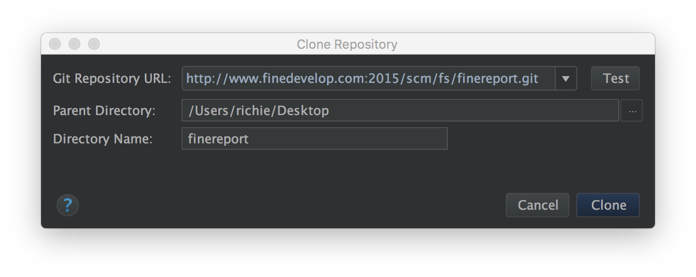

# 源码下载方式

以使用IntelliJ IDEA为例子

1. 从菜单栏上选择VCS->Checkout from Version Control->Git
2. 按照如图所示的方式输入信息
3. 点击Clone即可把代码克隆到桌面上（注意Parent Directory的值是自己想存放源码的磁盘位置）

# 插件开发入门以及调试教程
参见这里：[http://www.finedevelop.com/w/plugin/debug](http://www.finedevelop.com/w/plugin/debug)

# FineReport V8.0设计器开发工程配置

所需环境：JDK1.8、IntelliJ IDEA 14+或者eclipse

依赖关系
> lib
> > designer_base
> > > designer_chart
> > > 
> > > designer_form
> > > 
> > > designer

用eclipse直接导入此工程或者用IntelliJ IDEA直接打开此工程即可

